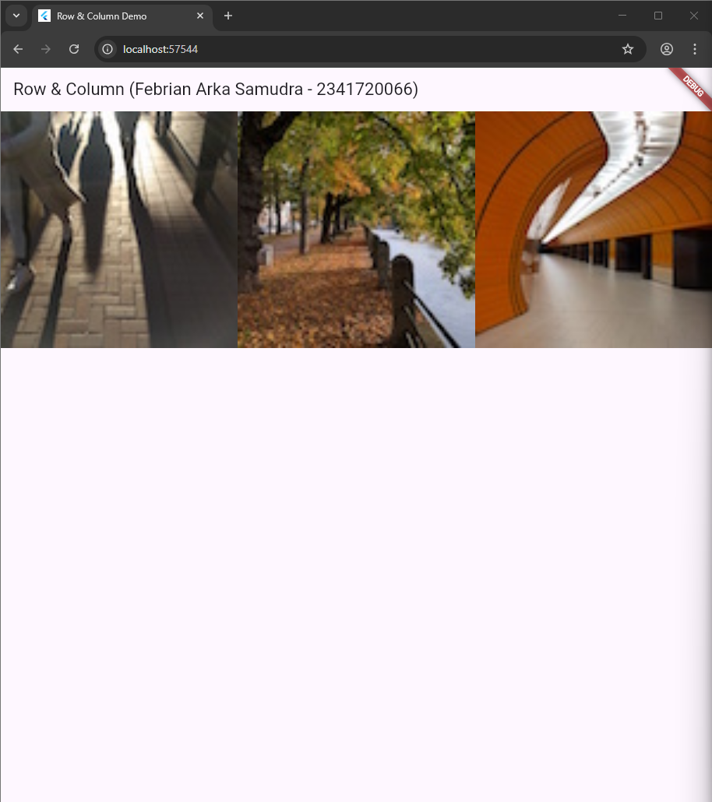

## Overview
This project demonstrates 16 different Flutter layouts, starting from a simple “Hello World” view and progressing to more complex designs like rating sections, image grids, lists, and stacked widgets. Each result showcases Flutter’s flexibility in arranging and styling widgets effectively.

---

### 1. Hello World Layout
  
This introductory example demonstrates the most basic Flutter layout using the Center widget to display text in the middle of the screen. It establishes the foundation of Flutter's widget tree structure with a Scaffold as the root container and a simple Text widget for content display.

---

### 2. Row Layout - Horizontal Arrangement
  
This example introduces the Row widget, which arranges child widgets horizontally across the screen. Three images are displayed side by side, demonstrating how Row distributes space among its children and handles horizontal alignment within the available width.

---

### 3. Column Layout - Vertical Arrangement
  
Here the Column widget is showcased, which stacks child widgets vertically from top to bottom. The same three images are now arranged in a vertical layout, illustrating how Column manages spacing and alignment along the vertical axis.

---

### 4. Row with Expanded Widgets
  
This layout demonstrates the Expanded widget within a Row, showing how child widgets can be made to fill available horizontal space proportionally. Each image expands to occupy equal width, creating a responsive layout that adapts to different screen sizes.

---

### 5. Stack Layout with Overlapping Elements
  
The Stack widget is introduced here, enabling widgets to be layered on top of each other. This example shows images positioned at different z-index levels, with the center image appearing larger and overlapping the side images, creating a depth effect.

---

### 6. Rating Widget with Stars
  
This example implements a simple rating display using Row to arrange star icons horizontally. It demonstrates how to combine Icon widgets with styling to create a common UI pattern showing a 3 out of 5 star rating.

---

### 7. Recipe Information Card
  
A more complex layout combining multiple widgets including stars for ratings, icons for different information categories, and text widgets. This demonstrates how to create information-dense layouts with proper spacing and visual hierarchy using Column and Row combinations.

---

### 8. Complete Recipe Card - Composition
  
This builds upon the previous example by adding all recipe details including preparation time, cooking time, and serving information. It showcases how multiple layout widgets can be nested to create professional-looking information cards with proper organization.

---

### 9. Pavlova Recipe with Image
  
This example introduces image integration alongside text and rating information, demonstrating how to create a balanced layout with both visual and textual content. The layout uses Row to place descriptive text on the left and a prominent food image on the right.

---

### 10. Responsive Pavlova Layout
  
An enhanced version of the previous example showing responsive design principles. The layout adapts to wider screens by adjusting the proportions between the text section and image, maintaining visual balance across different viewport sizes.

---

### 11. Simple Image Gallery
  
This demonstrates a basic grid layout using Row widgets to create a simple gallery view. Multiple images are arranged in a uniform grid pattern, introducing the concept of creating repeating layout patterns for content display.

---

### 12. Decorated Gallery with Borders
  
Building on the gallery concept, this example adds Container widgets with decorative borders around each image. It shows how to use padding, borders, and background colors to create visually distinct card-like elements in a grid layout.

---

### 13. Responsive Grid Gallery
  
A comprehensive gallery implementation using GridView or Wrap widget to create a responsive grid that adapts to screen size. Images are arranged in rows that wrap based on available space, demonstrating Flutter's built-in responsive layout capabilities.

---

### 14. ListView with Icons and Text
  
This introduces the ListView widget for creating scrollable lists of items. Each list item combines icons and text using ListTile widgets, demonstrating a common pattern for displaying categorized information like theaters and restaurants.

---

### 15. Profile with Stack Widget
  
A centered profile layout using Stack to layer elements, creating a profile card with a circular avatar image and text overlay. This demonstrates how Stack can be used for creating profile headers with overlapping design elements.

---

### 16. Contact Card with ListTile
  
The final example shows a contact information card using Card and ListTile widgets to display contact details with appropriate icons. This pattern is commonly used in contact lists and profile screens, demonstrating how to create clean, organized information displays with visual indicators.

---
